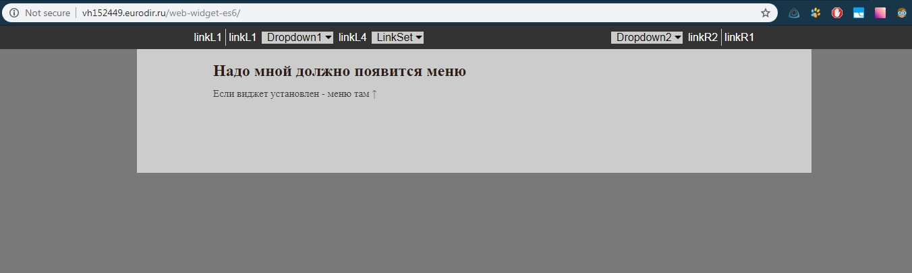
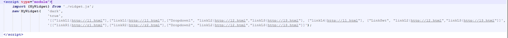

# Menu Widget JS-script with Links

Menu Widget ES6-script | Сan be added on any website with jQuery | Separate settings for links, centering and theme

demo: [http://vh152449.eurodir.ru/web-widget-es6](http://vh152449.eurodir.ru/web-widget-es6)

## Instruction

- use any your website or host the demo site (index.html & app.min.css)
- insert **widget code** in the demo

## Widget code

Insert this <script> code in the end of the <body> section on your web site:

<pre style="color:#000000;background:#ffffff;">&lt;script type="module"&gt;
   import {MyWidget} from './widget.js';
   new MyWidget('dark', 'true',
                '[["linkL1|http://l1.html"],["linkL1|http://l1.html"],["Dropdown1", "linkL2|http://l2.html","linkL3|http://l3.html"], ["linkL4|http://l1.html"], ["LinkSet", "linkL2|http://l2.html","linkL3|http://l3.html"]]',
                '[["linkR1|http://r1.html"],["linkR2|http://r2.html"],["Dropdown2", "linkL2|http://l2.html","linkL3|http://l3.html"]]'
               );
&lt;/script&gt;
</pre>

you can use settings params, where

- **center** can be "true" or "false", true - will center left and right urls bars
- **theme** can be "dark" and "light", for dark and light appearance
- **left** and rigth links - put the link names and urls, also make dropdowns with links

## Widget es6-script & demo page

Widget uses ES6 without polyfill
